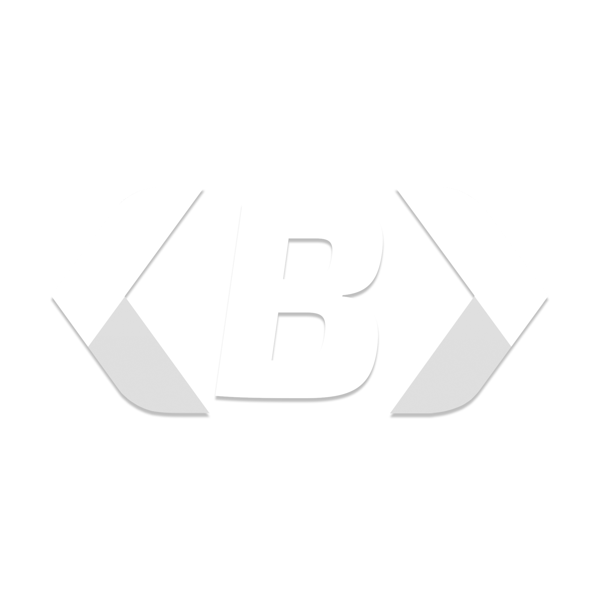

# Bablo-HUD

A modern, highly customizable HUD for FiveM servers with support for multiple frameworks and standalone operation.



## ✨ Features

- **Multi-Framework Support**: QBCore, ESX, Qbox, ND Core, vRP, and Standalone/Custom
- **Standalone Mode**: Works without any framework (uses default values)
- **No Inventory Required**: Weapon images fallback to built-in icons
- **Fully Customizable**: Extensive configuration via `config.lua` and in-game settings menu
- **Modern UI**: Clean, responsive NUI built with Vue.js
- **Vehicle Systems**: Speedometer, fuel, seatbelt, engine control, nitro, vehicle control panel
- **Status System**: Health, armor, hunger, thirst, stress, stamina, oxygen, nitro
- **Player Info Panel**: ID, job, gang, money (cash/bank/dirty), time, weapon info
- **Minimap**: Square/circle styles, custom masks, transition animations
- **Compass**: Direction, street, zone display
- **Notifications**: Multiple styles (linear, circular, overlay) with sounds
- **Progress Bars**: Linear, circular, with animations and props
- **Cinematic Mode**: Letterbox bars with HUD/radar hiding
- **Voice Integration**: pma-voice, saltychat, yaca support
- **Stress System**: Integrated with visual effects (blur, shake, impairment)
- **Global Config**: Server-wide settings with per-player overrides
- **Localization**: Multi-language support (EN, FI, FR, SV)

## 📋 Supported Frameworks

| Framework | Auto-Detect Resource | Config Value |
|-----------|---------------------|--------------|
| Qbox | `qbx_core` | `"qbox"` |
| ND Core | `nd-core` | `"nd"` |
| vRP | `vRP` | `"vrp"` |
| QBCore | `qb-core` | `"qbcore"` |
| ESX | `es_extended` | `"esx"` |
| Standalone/Custom | (none) | `"standalone"` or `"auto"` |

## 🚀 Installation

1. **Download/Clone** the resource to your server's resources folder:
   ```bash
   git clone https://github.com/kingplayz1/Fivem-HUD.git [qb]/bablo-hud
   ```

2. **Add to server.cfg** (ensure it starts after your framework and ox_lib):
   ```cfg
   ensure ox_lib
   ensure [qb]/bablo-hud
   ```

3. **Configure** `config.lua` to match your server setup (see [Configuration](#configuration))

4. **Start your server** - the HUD will auto-detect your framework

## ⚙️ Configuration

### Framework Selection (`config.lua`)

```lua
Config.Framework = "auto" -- "auto", "standalone", "qbcore", "esx", "qbox", "nd", "vrp"
```

- `"auto"` - Automatically detects running framework (recommended)
- `"standalone"` - Runs without framework (uses default values)
- Explicit framework - Forces specific framework

### Key Configuration Sections

```lua
-- Weapon images (works without inventory!)
Config.WeaponImageInventory = "ox_inventory" -- or "none" for built-in only

-- Currency format
Config.Currency = "$_"

-- Speed unit
Config.SpeedUnit = "kmh" -- or "mph"

-- Voice script
Config.VoiceScript = "pma-voice" -- "pma-voice", "saltychat", "yaca"

-- Feature toggles
Config.Nitro.enabled = false
Config.Seatbelt.enabled = true
Config.ControlHints.enabled = false
Config.Cinematic.enabled = true
```

See `config.lua` for complete configuration options (23KB+ of documented settings).

## 🎮 Commands & Keybinds

| Command | Default Key | Description |
|---------|-------------|-------------|
| `/hudsettings` | `I` | Open HUD settings panel |
| `/carcontrol` | `M` | Open vehicle control panel |
| `/cinematic` | - | Toggle cinematic mode |
| `/hudinfo` | - | Debug: Show KVP data & resolution info |
| `/removekvp` | - | Debug: Remove minimap position KVP |
| `/testaudio` | - | Debug: Test custom audio cues |

**Vehicle Direct Binds** (when enabled):
- `LEFT` / `RIGHT` - Toggle indicators
- `DOWN` - Toggle hazards

## 🖥️ In-Game Settings Menu

Access via `/hudsettings` or keybind `I`. Allows players to customize:

- **Minimap**: Style (square/circle), size, position, north indicator
- **Status Bars**: Design (v1-v4), colors, visibility, auto-hide thresholds
- **Notifications**: Style, theme, sound, volume, opacity, position
- **Player Info**: Which pills to show, colors, time source (ingame/local/server)
- **Compass**: On-foot display, opacity, elements
- **Voice**: Position (standalone/status), color
- **Progress Bar**: Style, color, border radius
- **Speedometer**: Style (5 variants), highlight, color

Settings are saved per-player via KVP (Key-Value Pairs).

## 🌐 Standalone Mode

When no framework is detected or `Config.Framework = "standalone"`:

- Hunger/Thirst: Always 100
- Stress: Always 0
- Job: "Unemployed"
- Money: $0 cash, $0 bank
- Player Name: FiveM name
- Vehicle Fuel: Native `GetVehicleFuelLevel`
- Notifications: Native GTA notifications
- All HUD elements functional with default values

Perfect for:
- Freeroam servers
- Custom frameworks
- Lightweight servers without full frameworks
- Testing/development

## 🎨 Weapon Images Without Inventory

Set in `config.lua`:
```lua
Config.WeaponImageInventory = "none" -- Uses bablo-hud's built-in weapon icons
```

Or leave as any inventory name - if that inventory resource isn't running, it automatically falls back to built-in icons.

Built-in weapon icons location: `weapons/` folder (add your own `.png`/`.webp` files)

## 🔧 Developer API (Exports)

```lua
-- Progress Bar
exports['bablo-hud']:ProgressBar({duration=5000, label="Crafting", color="primary"})
exports['bablo-hud']:UpdateProgressBar(50)
exports['bablo-hud']:CompleteProgressBar()
exports['bablo-hud']:StopProgressBar()

-- Vehicle Control
exports['bablo-hud']:OpenVehicleControl()
exports['bablo-hud']:CloseVehicleControl()
exports['bablo-hud']:ToggleVehicleControl()
exports['bablo-hud']:IsVehicleControlOpen()

-- Cinematic
exports['bablo-hud']:ToggleCinematic()
exports['bablo-hud']:SetCinematic(true)
exports['bablo-hud']:IsCinematicActive()

-- Control Hints
exports['bablo-hud']:ShowControlHints({{id=1, label="Interact", key="E"}}, 5000)
exports['bablo-hud']:HideControlHints(1)
exports['bablo-hud']:ClearControlHints()

-- Notifications
exports['bablo-hud']:Notify("Title", "Description", "success", 5000)

-- Custom Status Gauges
exports['bablo-hud']:SetCustomStatus("radiation", 75)
```

## 🎯 Events

**Client Events:**
```lua
-- Progress Bar
RegisterNetEvent('bablo-hud:progressbar:start', function(data) end)
RegisterNetEvent('bablo-hud:progressbar:update', function(data) end)
RegisterNetEvent('bablo-hud:progressbar:complete', function() end)
RegisterNetEvent('bablo-hud:progressbar:stop', function() end)

-- Vehicle Control
RegisterNetEvent('bablo-hud:vehiclecontrol:open', function() end)
RegisterNetEvent('bablo-hud:vehiclecontrol:close', function() end)
RegisterNetEvent('bablo-hud:vehiclecontrol:toggle', function() end)

-- Cinematic
RegisterNetEvent('bablo-hud:cinematic:toggle', function() end)
```

**Server Events:**
```lua
-- Request server info (hostname, serverId)
TriggerServerEvent('bablo-hud:requestServerInfo')

-- Set stress (from framework)
TriggerServerEvent('bablo-hud:server:setStress', value)
```

## 🌍 Localization

Add new languages in `locales/<code>.json`:
```json
{
  "framework.fallbacks.jobLabel": "Unemployed",
  "framework.fallbacks.jobGrade": "0",
  "notifications.settingsLocked": "HUD customization is managed by the server."
}
```

Set in config: `Config.Locale = "en-US"`

## 🛠️ Adding Custom Framework Support

1. Create `src/frameworks/yourframework/client.lua`
2. Create `src/frameworks/yourframework/server.lua` (optional, for admin checks)
3. Implement the Framework interface (see existing frameworks)
4. Add to `fxmanifest.lua` client_scripts/server_scripts
5. Add detection in `src/resource/shared/functions.lua`

## 📁 File Structure

```
bablo-hud/
├── config.lua                 # Main configuration
├── fxmanifest.lua             # FiveM manifest
├── README.md                  # This file
├── assets/                    # Static assets (logo, etc.)
├── weapons/                   # Built-in weapon icons
├── locales/                   # Translation files
├── stream/                    # Streamed files (ytd, gfx, ycd)
├── audiodirectory/            # Custom audio bank
├── data/                      # Audio data files
└── src/
    ├── frameworks/            # Framework implementations
    │   ├── qb/
    │   ├── esx/
    │   ├── qbox/
    │   ├── nd/
    │   └── vrp/
    └── resource/
        ├── client/            # Client-side scripts
        │   ├── modules/       # HUD modules
        │   └── ...
        ├── server/            # Server-side scripts
        └── shared/            # Shared utilities
```

## 🔒 Global Config (Admin)

Enable in `config.lua`:
```lua
Config.GlobalConfig.enabled = true
```

Admins can then use `/hudsettings` → "Publish Globally" to push settings to all players.

## 📦 Dependencies

- **Required**: `ox_lib` (for callbacks, notifications, etc.)
- **Optional**: 
  - `oxmysql` (for mileage persistence)
  - Voice resource (`pma-voice`, `saltychat`, or `yaca`)
  - Inventory resource (for weapon images - `ox_inventory`, `qb-inventory`, etc.)
  - Mileage resource (if using `provider = "framework"`)

## 🐛 Debug Commands

- `/hudinfo` - Comprehensive debug info (KVP, resolution, minimap anchor)
- `/removekvp` - Clear minimap position (debug only)
- `/testaudio` - Test custom audio cues

Enable debug mode: `Config.DEBUG = true`

## 📝 License

This resource is licensed under the MIT License. See [LICENSE](LICENSE) for details.

## 🙏 Credits

- **Original Author**: Bablo Resources
- **Framework Integrations**: Community contributors
- **UI Framework**: Vue.js
- **Icons**: Lucide Icons
- **Fonts**: SF Pro Display (Apple)

## 🔗 Links

- **Repository**: https://github.com/kingplayz1/Fivem-HUD
- **Issues**: https://github.com/kingplayz1/Fivem-HUD/issues
- **Discord**: https://discord.gg/RpH5QDWNqz

---

**Made with ❤️ for the FiveM community**
